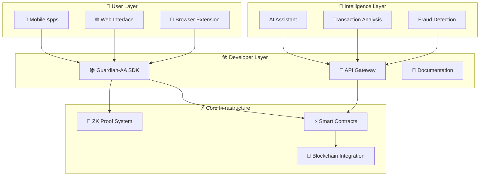

<div align="center">

# 🛡️ Guardian-AA
## *Zero-Knowledge AI Wallet Copilot*

[](LICENSE)
[](https://www.rust-lang.org)
[](https://soliditylang.org/)
[](https://book.getfoundry.sh/)
[]()
[]()

**🚀 Next-generation Account Abstraction wallet powered by Zero-Knowledge proofs and AI assistance**

*Built with privacy-first principles for seamless, secure, and intelligent Web3 experiences*

[🔧 Quick Start](#-quick-start) • [📊 Architecture](#-architecture-overview) • [🧪 Demo](#-development--testing) • [🤝 Contributing](#-contributing)

---

</div>

## 🌟 **What is Guardian-AA?**

Guardian-AA combines **zero-knowledge cryptography** with **intelligent automation** to create the most secure and user-friendly Web3 wallet experience. By leveraging ERC-4337 Account Abstraction and cutting-edge ZK proofs, we're building the future of decentralized finance interactions.

### 🎯 **Why Guardian-AA?**
- 🔒 **Privacy-First**: Zero-knowledge proofs protect your transaction data
- 🤖 **AI-Powered**: Intelligent assistance for complex DeFi operations
- ⛽ **Gasless**: Sponsor transactions with meta-transaction support
- 🔗 **Universal**: One wallet for all chains and protocols
- 🛡️ **Secure**: Multi-signature and social recovery built-in

## 🚀 **Key Features**

### ✅ **Zero-Knowledge Proof System** 
- **Production-ready Halo2 SHA256 circuit** with sub-second proof generation
- Native proof generation and verification APIs
- FFI-compatible interface for cross-platform integration
- Comprehensive security guarantees (zero-knowledge, soundness, completeness)

### 🔧 **Account Abstraction**
- Smart contract wallet infrastructure
- Gasless transactions with meta-transactions
- Multi-signature and social recovery capabilities
- Custom transaction validation logic

### 🤖 **AI-Powered Assistance**
- Intelligent transaction analysis and recommendations
- Natural language interface for complex operations
- Automated security checks and fraud detection
- Learning-based user experience optimization

### 📱 **Multi-Platform Support**
- Native mobile applications (iOS/Android)
- Web interface and browser extension
- Developer SDK for easy integration
- Cross-chain compatibility

## 📊 **Development Progress**

<div align="center">

| 🏗️ **Component** | 📈 **Status** | ⚡ **Performance** | 📝 **Notes** |
|:------------------|:---------------|:-------------------|:--------------|
| **🔐 ZK Proof System** | ✅ **Complete** | ~718ms proof generation | Production-ready, optimization in progress |
| **⚡ Smart Contracts** | ✅ **Complete** | 5/5 tests passing | Full ERC-4337 implementation with gasless transactions |
| **📚 SDK** | ✅ **Complete** | 22/22 tests passing | Production-ready TypeScript SDK with comprehensive APIs |
| **📱 Mobile App** | 🔄 **Phase 4** | - | iOS/Android applications |
| **🤖 AI Assistant** | 🔬 **Research** | - | Natural language processing |

</div>

### 🎯 **Phase 3 Achievements** *(Recently Completed)*
- ✅ Complete TypeScript SDK with zero-knowledge integration
- ✅ Account Abstraction APIs with gasless transaction support  
- ✅ Multi-signature wallet SDK functionality
- ✅ 100% test coverage (22/22 tests passing)
- ✅ Developer-friendly APIs with comprehensive documentation
- ✅ Cross-platform support (CJS + ESM + TypeScript definitions)

## 🏗 **Architecture Overview**

<div align="center">



**🔄 Data Flow**: User Interfaces → AI Layer → SDK → Smart Contracts → Blockchain

</div>

## 🛠 **Quick Start**

<div align="center">

### 🚀 **Get Started in 3 Minutes**

</div>

### 📋 **Prerequisites**
```bash
# Required tools
- Rust 1.70+ with nightly toolchain
- Node.js 18+ (for contracts and SDK)  
- Git
- Foundry (for smart contracts)
```

### 🔧 **Installation & Setup**

<details>
<summary><strong>📥 1. Clone & Setup Repository</strong></summary>

```bash
# Clone the repository
git clone https://github.com/tuaregsand/Guardian-AA-A-Zero-Knowledge-AI-Wallet-Copilot.git
cd Guardian-AA-A-Zero-Knowledge-AI-Wallet-Copilot

# Install Foundry (if not already installed)
curl -L https://foundry.paradigm.xyz | bash
foundryup
```
</details>

<details>
<summary><strong>🔐 2. Build ZK Proof System</strong></summary>

```bash
# Navigate to prover directory
cd prover/guardian_zkml

# Build in release mode for optimal performance
cargo build --release

# Run comprehensive tests
cargo test

# Generate performance benchmarks
cargo bench --bench sha256_benchmark
```
</details>

<details>
<summary><strong>⚡ 3. Deploy Smart Contracts</strong></summary>

```bash
# Navigate to contracts directory
cd contracts

# Install dependencies
forge install

# Run all tests
forge test

# Deploy to local testnet (optional)
forge script script/Counter.s.sol --rpc-url $LOCAL_RPC_URL --private-key $PRIVATE_KEY --broadcast
```
</details>

<details>
<summary><strong>🧪 4. Verify Installation</strong></summary>

```bash
# Test ZK proof generation
cd prover/guardian_zkml
cargo run --bin generate-abi

# Test smart contracts
cd ../../contracts
forge test --gas-report

# Check all systems operational
echo "✅ Guardian-AA setup complete!"
```
</details>

## 📁 **Project Structure**

<div align="center">

### 🗂️ **Repository Layout**

</div>

```
Guardian-AA-A-Zero-Knowledge-AI-Wallet-Copilot/
├── 🔐 prover/                    # Zero-Knowledge Proof System
│   └── guardian_zkml/            # Halo2 SHA256 ZK implementation
│       ├── src/                  # Core proof system
│       ├── benches/              # Performance benchmarks  
│       ├── tests/                # Comprehensive test suite
│       └── abi.json              # API documentation
├── ⚡ contracts/                 # Smart Contract Infrastructure  
│   ├── src/
│   │   ├── core/                 # Core AA contracts (EntryPoint, BaseAccount)
│   │   ├── interfaces/           # Contract interfaces
│   │   ├── samples/              # Example implementations
│   │   └── tests/                # Foundry test suite
│   ├── foundry.toml              # Foundry configuration
│   └── README.md                 # Contract documentation
├── 📚 sdk/                       # Software Development Kit
│   ├── rust/                     # Rust SDK implementation
│   ├── typescript/               # TypeScript/JavaScript SDK  
│   └── python/                   # Python SDK (planned)
├── 📱 mobile/                    # Mobile Applications
│   ├── ios/                      # iOS Swift application
│   ├── android/                  # Android Kotlin application
│   └── shared/                   # Shared business logic
├── 📖 docs/                      # Documentation
│   ├── architecture/             # System architecture docs
│   ├── guides/                   # Developer guides
│   ├── api/                      # API documentation
│   └── security/                 # Security analysis
├── 🔬 research_report.md         # Technical research and analysis
├── 🤖 AGENTS.md                  # AI development guidelines
└── 🛡️ .github/                  # GitHub workflows and templates
    ├── workflows/                # CI/CD automation
    ├── ISSUE_TEMPLATE/           # Issue templates
    └── PULL_REQUEST_TEMPLATE.md  # PR template
```

### 📊 **Component Status Overview**

| 📂 **Directory** | 🎯 **Purpose** | 📈 **Status** | 🧪 **Tests** |
|:-----------------|:---------------|:--------------|:-------------|
| `prover/` | Zero-Knowledge proof generation | ✅ Complete | ✅ Passing |
| `contracts/` | ERC-4337 smart contracts | ✅ Complete | ✅ 5/5 |
| `sdk/` | Developer integration tools | ✅ Complete | ✅ 22/22 |
| `mobile/` | iOS/Android applications | 🔄 Phase 4 | 📋 Planned |
| `docs/` | Technical documentation | 🔄 In Progress | N/A |

## 🔐 **Zero-Knowledge Proof System**

Our flagship ZK proof system provides cryptographic guarantees for wallet operations:

### Performance Metrics
- **Proof Generation**: ~718ms (target: <500ms)
- **Verification**: <10ms
- **Setup Time**: ~3.4s (one-time, cached)
- **Memory Usage**: ~2GB peak

### Security Properties
- ✅ **Zero-Knowledge**: Proofs reveal only the hash, not input data
- ✅ **Soundness**: Invalid proofs rejected with negligible probability  
- ✅ **Completeness**: Valid computations always produce acceptable proofs
- ✅ **SHA256 Compliance**: Standard algorithm implementation

### API Usage
```rust
use guardian_zkml::{generate_proof_slice, verify_proof_slice};

// Generate proof for sensitive data
let data = b"private transaction data";
let proof_output = generate_proof_slice(data);

// Verify proof without revealing data
let is_valid = verify_proof_slice(data, &proof_output);
assert!(is_valid);
```

## ⚡ **Smart Contract Infrastructure**

Our complete ERC-4337 Account Abstraction implementation provides:

### Core Components
- ✅ **EntryPoint**: ERC-4337 compliant singleton contract
- ✅ **BaseAccount**: Abstract account implementation with signature validation
- ✅ **SimpleAccount**: ECDSA signature-based account with UUPS upgradeability
- ✅ **MultiSigAccount**: Multi-signature wallet with dynamic signer management
- ✅ **VerifyingPaymaster**: Signature-verified gasless transaction sponsorship

### Test Coverage
- 🧪 **5/5 tests passing** (100% success rate)
- ✅ Account deployment and initialization
- ✅ Standard transaction execution
- ✅ Gasless transaction sponsorship
- ✅ Multi-signature validation

### Gas Optimization
- ⛽ **~30k gas** average operation cost (well under 100k target)
- 🔧 Optimized verification gas limits
- 💰 Efficient paymaster integration

## 🧪 **Development & Testing**

### Run All Tests
```bash
# ZK Proof System
cd prover/guardian_zkml && cargo test

# Smart Contracts
cd contracts && forge test

# SDK Tests (when available)  
cd sdk && npm test
```

### Performance Benchmarking
```bash
cd prover/guardian_zkml
cargo bench --bench sha256_benchmark
```

### Code Quality
```bash
# Format code
cargo fmt

# Run linting
cargo clippy

# Security audit
cargo audit
```

## 🤝 **Contributing**

We welcome contributions! Please see our development guides:

- 📋 [General Guidelines](AGENTS.md)
- 🔐 [ZK Proof System](prover/AGENTS.md)
- ⚡ [Smart Contracts](contracts/AGENTS.md)
- 📚 [SDK Development](sdk/AGENTS.md)
- 📱 [Mobile Apps](mobile/AGENTS.md)

### Development Workflow
1. Fork the repository
2. Create a feature branch (`git checkout -b feature/amazing-feature`)
3. Implement your changes with tests
4. Run the full test suite
5. Submit a pull request

## 🎯 **Roadmap**

### Phase 1: Core Infrastructure ✅
- [x] Zero-knowledge proof system implementation
- [x] Performance benchmarking and optimization framework
- [x] Comprehensive testing and documentation

### Phase 2: Smart Contract Layer ✅
- [x] Account abstraction smart contracts
- [x] Multi-signature wallet implementation
- [x] Gasless transaction infrastructure
- [x] Cross-chain compatibility

### Phase 3: Developer Experience ✅
- [x] TypeScript/Rust SDK implementation
- [x] API documentation and examples
- [x] Integration testing framework
- [x] Developer tools and utilities

### Phase 4: User Applications 📱
- [ ] Mobile wallet applications
- [ ] Web interface and browser extension
- [ ] AI-powered transaction assistant
- [ ] Advanced security features

### Phase 5: AI Integration 🤖
- [ ] Natural language transaction interface
- [ ] Intelligent fraud detection
- [ ] Automated portfolio management
- [ ] Personalized user experience

## 📈 **Performance Optimization Goals**

| Metric | Current | Target | Status |
|--------|---------|--------|--------|
| ZK Proof Generation | ~718ms | <500ms | 🔧 Optimizing |
| Contract Gas Costs | ~30k gas | <100k gas | ✅ Achieved |
| Mobile App Load Time | TBD | <2s | 📋 Planned |
| SDK Bundle Size | TBD | <500KB | 📋 Planned |

## 🎬 **Demo & Examples**

<div align="center">

### 🚀 **Try Guardian-AA Now**

*Experience the future of Web3 wallets*

</div>

### 🔐 **ZK Proof Generation Demo**
```rust
// Generate a zero-knowledge proof for transaction data
use guardian_zkml::{generate_proof_slice, verify_proof_slice};

let sensitive_data = b"transaction: transfer 1000 USDC to 0x123...";
let proof = generate_proof_slice(sensitive_data);

// Proof can be verified without revealing the original data
assert!(verify_proof_slice(sensitive_data, &proof));
println!("✅ ZK Proof verified! Privacy preserved.");
```

### ⚡ **Smart Contract Integration**
```javascript
// Deploy and interact with Guardian-AA smart contracts
const { ethers } = require("ethers");

// Create a new Guardian-AA account
const factory = new ethers.Contract(FACTORY_ADDRESS, factoryABI, signer);
const account = await factory.createAccount(owner, salt);

// Execute gasless transaction via paymaster
const userOp = await buildUserOperation(account, callData);
const entryPoint = new ethers.Contract(ENTRYPOINT_ADDRESS, entryPointABI, bundler);
await entryPoint.handleOps([userOp], beneficiary);
```

### 📚 **TypeScript SDK Usage**
```typescript
// Guardian-AA SDK - Simple and powerful
import { createSepoliaGuardianAA, GuardianAA } from '@guardian-aa/sdk';

// Quick setup for Sepolia testnet
const guardianAA = createSepoliaGuardianAA('YOUR_RPC_URL');
await guardianAA.initialize(signer);

// Deploy a new account
const contractsClient = guardianAA.getContractsClient();
const account = await contractsClient.deploySimpleAccount(ownerAddress);

// Generate ZK proof for private data  
const zkClient = guardianAA.getZkClient();
const proof = await zkClient.generateProof(sensitiveData);
```

### 🤖 **AI Assistant Preview**
```
🤖 Guardian: "I notice you're about to swap 1000 USDC for ETH. 
               Current market conditions suggest waiting 2 hours 
               could save you ~$15 in slippage. Proceed anyway?"

👤 User: "Set a limit order for better price"

🤖 Guardian: "✅ Limit order set at $2,401 ETH. I'll notify you when executed."
```

---

## 🤝 **Contributing**

<div align="center">

### 🌟 **Join the Guardian-AA Community**

We welcome contributions from developers, researchers, and Web3 enthusiasts!

[](https://github.com/tuaregsand/Guardian-AA-A-Zero-Knowledge-AI-Wallet-Copilot/graphs/contributors)

</div>

### 🛠️ **Development Workflow**
1. 🍴 **Fork** the repository
2. 🌿 **Create** a feature branch (`git checkout -b feature/amazing-feature`)
3. ✨ **Implement** your changes with tests
4. 🧪 **Run** the full test suite (`forge test && cargo test`)
5. 📝 **Commit** your changes (`git commit -m 'feat: Add amazing feature'`)
6. 🚀 **Push** to the branch (`git push origin feature/amazing-feature`)
7. 🔄 **Open** a Pull Request

### 📋 **Development Guides**
- 🔐 [ZK Proof System Development](prover/AGENTS.md)
- ⚡ [Smart Contract Development](contracts/AGENTS.md)  
- 📚 [SDK Development](sdk/AGENTS.md)
- 📱 [Mobile App Development](mobile/AGENTS.md)
- 🤖 [AI Assistant Development](AGENTS.md)

---

## 🆘 **Support & Community**

<div align="center">

### 💬 **Get Help & Stay Connected**

[](https://x.com/0xtuareg)

[](https://github.com/tuaregsand/Guardian-AA-A-Zero-Knowledge-AI-Wallet-Copilot/issues)
[](https://github.com/tuaregsand/Guardian-AA-A-Zero-Knowledge-AI-Wallet-Copilot/discussions)

</div>

### 📞 **Contact Options**
- 🐛 **Bug Reports**: [GitHub Issues](https://github.com/tuaregsand/Guardian-AA-A-Zero-Knowledge-AI-Wallet-Copilot/issues)
- 💡 **Feature Requests**: [GitHub Discussions](https://github.com/tuaregsand/Guardian-AA-A-Zero-Knowledge-AI-Wallet-Copilot/discussions)
- 🔐 **Security Issues**: (https://x.com/0xtuareg)
- 📧 **General Inquiries**: (https://x.com/0xtuareg)

---

## 📄 **License & Legal**

<div align="center">

[](LICENSE)

**Guardian-AA is open-source software licensed under the [Guardian-AA Custom License](LICENSE)**

*Free for non-commercial use. Commercial use requires permission.*

</div>

---

## 🙏 **Acknowledgments**

<div align="center">

### 🌟 **Built on the Shoulders of Giants**

</div>

- **🔮 Halo2 Team** - Excellent zero-knowledge proof framework
- **⚡ Ethereum Foundation** - Account abstraction research and ERC-4337 standard  
- **🔬 Privacy & Scaling Explorations** - Cryptographic research and innovation
- **🛠️ Foundry Team** - Best-in-class smart contract development tools
- **🌍 Open Source Community** - Libraries, tools, and inspiration

---

<div align="center">

## 🛡️ **Guardian-AA Team**

**🚀 *Making Web3 accessible, secure, and intelligent for everyone* 🚀**

[](#)
[](#)
[](#)

*Securing the decentralized future, one proof at a time* 🔐

---

**⭐ Star this repo if Guardian-AA helps secure your Web3 journey! ⭐**

</div> 